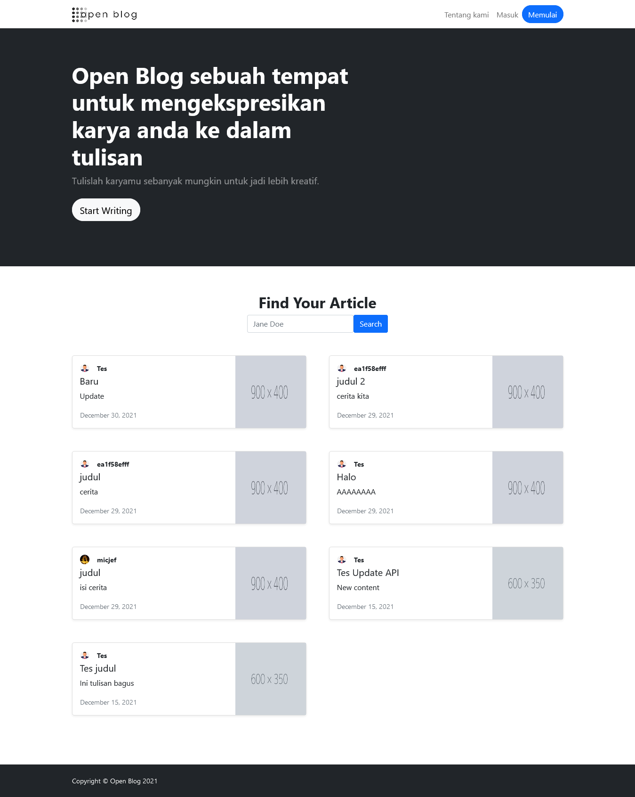
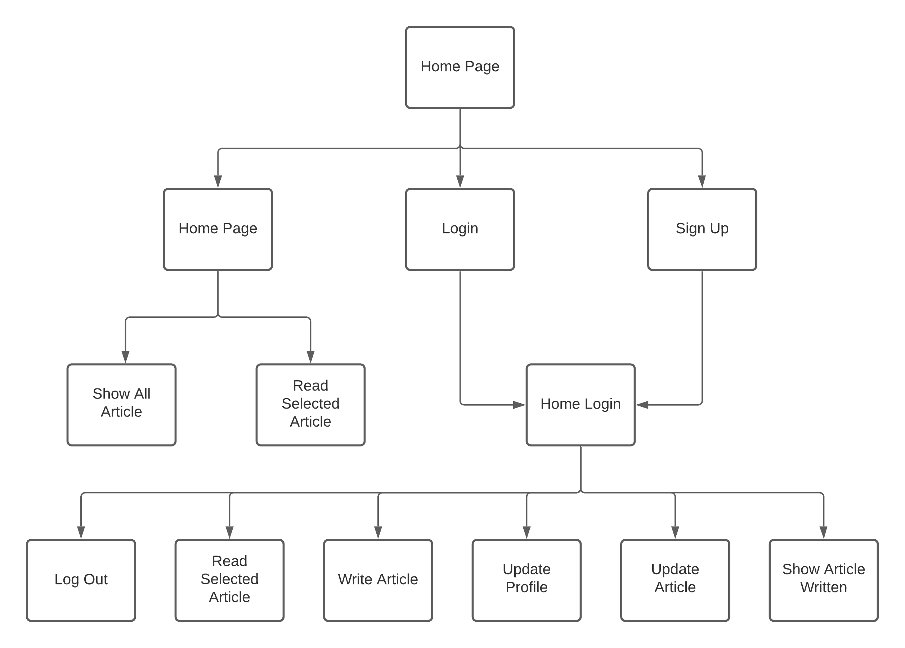

<div align="center">
    
    <h1>Open Blog</h1>
    <strong>Aplikasi blog yang dibuat untuk ramah digunakan penulis.</strong>
</div>
<br>
<div align="center">
    <a href="https://drone-gh.zecrea.my.id/FP-PEMWEB-KEL-7/OpenBlog">
        
    </a>
	<a href="https://github.com/FP-PEMWEB-KEL-7/OpenBlog/blob/master/license.txt">
        
    </a>
</div>
<div align="center">
    <a href="https://pemwebn.zecrea.my.id/"><b>Website</b></a>
	<br><br>
</div>

---

# Daftar Isi

- [Daftar Isi](#daftar-isi)
- [Pengantar](#pengantar)
- [Screenshot Halaman Utama](#screenshot-halaman-utama)
- [Sitemap](#sitemap)
- [Teknologi Yang Digunakan](#teknologi-yang-digunakan)
- [Cara Penggunaan](#cara-penggunaan)
- [Fitur](#fitur)
- [Penjelasan Struktur Aplikasi (source code)](#penjelasan-struktur-aplikasi-source-code)

---

# Pengantar

#### **Deskripsi Aplikasi**

Open Blog adalah sebuah website artikel blog yang ramah digunakan untuk semua kalangan usia. Dimana di dalam nya dapat menuangkan kata kata yang berasal dari sebuah ide kreatifitas dengan tampilan web yang user friendly dan juga melihat artikel artikel yang menarik untuk dibaca

#### **Disusun Oleh (Kelompok 7)**

1. Abiyan Naufal Hilmi [19081010135]
2. Dimas Aditya Putra [19081010190]
3. Michael Jeffry Setiawan [19081010007]
4. Muhammad Rakha Firjatullah [19081010050]
5. Nico Natanael [19081010023]

---

# Screenshot Halaman Utama


---

# Sitemap


#### **PENJELASAN**

- Pada Home Page, pengguna bisa mengakses/menuju ke Home Page, Login, dan Sign Up.
  - Selanjutnya, saat berada di home page juga dapat Melihat Semua Artikel, dan Membaca Artikel Pilihan.
- Saat pengguna selesai melakukan Login atau Sign Up, akan menuju ke halaman Home Login.
- Pada Home Login pengguna dapat mengakses Log Out, Membaca Artikel Pilihan, Membaca Artikel, Update Profil, Update Artikel, dan Melihat Artikel yang Telah Ditulis.

---
# Teknologi Yang Digunakan

**CodeIgniter 3**

Salah satu Framework PHP kuat dan tahan lama yang sangat populer dengan menggunakan Konsep MVC dan sering digunakan oleh developer dan komunitas di seluruh penjuru dunia. Dengan menggunakan Framework ini pula kita tidak akan terlalu kesulitan mencari tutorial yang membahas framework ini karena Developer Codeigniter 3 sudah menyediakan dokumentasi secara lengkap atau Table of Content yang bisa kalian lihat di User Guide.

**Bootstrap**

Kerangka kerja CSS yang sumber terbuka dan bebas untuk merancang situs web dan aplikasi web. Kerangka kerja ini berisi templat desain berbasis HTML dan CSS untuk tipografi, formulir, tombol, navigasi, dan komponen antarmuka lainnya, serta juga ekstensi opsional JavaScript. 

Tidak seperti kebanyakan kerangka kerja web lainnya, kerangka kerja ini hanya fokus pada pengembangan front-end saja. Dipakai untuk mendesain halaman depan atau tampilan website (front end).

**MySQL**

Sistem manajemen database relasional (RDBMS) berbasis SQL (Structured Query Language) yang bersifat open-source dengan model client-server.

---

# Cara Penggunaan

Sesuai dengan deskripsi aplikasi diawal, website ini berisi artikel artikel dimana user dapat membuat artikel secara pribadi dan dipublikasikan. 

#### **SEBELUM LOGIN**
Pada tahap awal sebelum login, user akan diperlihatkan dengan website yang sederhana, namun memanjakan mata.
Disini user akan diperlihatkan beberapa artikel yang telah tersedia . Namun, pengguna yang belum login tidak dapat membuat artikel, dapat langsung menuju fitur sign up, dan melukan login.
Untuk about, login dan sign up, terletak pada bagian kanan atas website. Jika kita menekan logo OpenBlog maka akan menuju ke tampilan home. User juga dapat melihat perancang website OpenBlog dengan menekan About, yang terletak pada navigation.
#### **SETELAH LOGIN**
Pada tahap selanjutnya, user kita asumsikan telah melakukan tahap login. Disini cara penggunaan aplikasi tidak jauh berbeda saat user belum melakukan login. Yang berbeda hanya user dapat melakukan penulisan artikel dan diposting. User juga dapat melihat halaman profil yang terletak di foto profil bagian atas kanan. Pada foto profil bagian kanan atas juga terdapat fitur sign out. Untuk melakukan penulisan artikel terletak pada logo (+(plus)) yang terletak pada kiri foto profil.

---

# Fitur

Sebelum Login (guest)
- **Navigation**
  <br>Pada Navigation terdapat fitur home, sign in, dan sign up.
  <br><Br>
  Untuk fitur home sendiri terletak pada logo OpenBlog. Jika kita menekan logo OpenBlog maka akan menuju ke halaman home.
  <br><br>
  Untuk fitur sign in terletak pada kanan atas navigation. Dimana jika kita menekan-nya akan menuju ke halaman sign in. User akan mengisi email dan password yang telah dibuat saat sign up.
  <br><br>
  Untuk fitur sign up terletak disamping kanan sign in, dengan nama 'Get Started'. Jika kita menekan-nya makan akan menuju ke halaman sign up, user diharapkan menisi email dan password.

- **Header**
  <br>Pada header website terdapat tampilan sederhana, yang mana didalam nya terdapat kalimat 'Start Writing'. Jika user menekan-nya, user akan langsung menuju halaman login.

- **Body**
  <br>Pada body website terdapat tampilan artikel artikel yang telah dibuat oleh user. Dan terdapat search bar untuk mencari artikel.

- **Halaman Postingan**
  <br>Pada halaman ini user melihat isi artikel yang telah dipilih untuk dibaca. Terdapat penulis, dan juga foto artikel.

Sesudah Login
- **Navigation**
  <br>Berbeda dengan navigation sebelum login. Pada saat user melewati tahapan login. Tampilan navigation akan berubah warna, terdapat foto profil, dan juga logo (+).
  <br><br>Pada foto profil dapat ditekan dan menampilkan markdown yang berisi setting, dan juga sign out.
  <br><br>Jika kita ingin menulis artikel dapat menekan logo (+). Sama halnya dengan navigation pada saat user belum login, logo OpenBlog jika ditekan akan menuju ke halaman home.
- **Setting**
  <br>Pada halaman setting terdapat fitur untuk mengganti foto profil, nama, dan juga password.
- **Body**
  <br>Untuk body website OpenBlog berisi artikel artikel yang user telah buat. Dan dapat dilihat dengan menekan judul artikel.
- **Halaman Postingan**
  <br>Pada halaman ini user melihat isi artikel yang telah dipilih untuk dibaca. Terdapat penulis, dan juga foto artikel.
- **Halaman Write Artikel**
  <br>Pada halaman ini, user akan mengisi foto artikel, judul artikel, dan isi artikel. Jika telah selesai, menekan tombol submit.

---

# Penjelasan Struktur Aplikasi (source code)
Berikut adalah struktur aplikasi yang terpenting

```bash
├── application/
│   ├── config/
│   │   ├── autoload.php
│   │   ├── config.php
│   │   ├── database.php
│   │   └── routes.php
│   ├── controllers/
│   │   ├── About.php
│   │   ├── Delete.php
│   │   ├── Edit.php
│   │   ├── Home.php
│   │   ├── Login.php
│   │   ├── Logout.php
│   │   ├── Post.php
│   │   ├── Setting.php
│   │   ├── Signup.php
│   │   └── Write.php
│   ├── models/
│   │   ├── Akun.php
│   │   └── Artikel.php
│   └── views/
│       ├── about.php
│       ├── delete.php
│       ├── home_logged_in.php
│       ├── home.php
│       ├── login.php
│       ├── post_logged_in.php
│       ├── post.php
│       ├── setting.php
│       ├── signup.php
│       └── write.php
└── .htaccess
```

Penjelasan
- **application/config/**
  - **autoload.php**
    <br>Aplikasi ini menggunakan autoload untuk load library saja, yaitu `database`, `session`, dan `form_validation`.
  - **config.php**
    <br>Sesuaikan base_url pada config sesuai dengan url pada tempat aplikasi ini dijalankan (misal hosting milik pribadi `example.com/openblog`).
  - **database.php**
    <br>Sesuaikan hostname, username, password, dan database dengan database yang akan digunakan.
  - **routes.php**
    <br>Berisi semua rute yang didaftarkan oleh aplikasi ini (`/home`, `/login`, `/about`, `/signup`, dsb).
- **application/controllers/**
  - **About.php**
    <br>Merupakan controller yang menghandle rute `/about`.
  - **Delete.php**
    <br>Merupakan controller yang menangani rute `/confirm_delete` dan `/proceed_delete`.
  - **Edit.php**
    <br>Merupakan controller yang menghandle rute `/edit`.
  - **Home.php**
    <br>Merupakan controller yang menghandle rute `/home` dan `/`.
  - **Login.php**
    <br>Merupakan controller yang menghandle rute `/login`.
  - **Logout.php**
    <br>Merupakan controller yang menghandle rute `/logout`.
  - **Post.php**
    <br>Merupakan controller yang menghandle rute `/post`.
  - **Setting.php**
    <br>Merupakan controller yang menghandle rute `/setting`.
  - **Signup.php**
    <br>Merupakan controller yang menghandle rute `/signup`.
  - **Write.php**
    <br>Merupakan controller yang menghandle rute `/write`.
- **application/models/**
  - **Akun.php**
    <br>Merupakan model yang membuat aplikasi dapat berinteraksi dengan table akun pada database.
  - **Artikel.php**
  	<br>Merupakan model yang membuat aplikasi dapat berinteraksi dengan table artikel pada database.
- **application/views/**
  - **about.php**
    <br>Merupakan view yang akan menjadi tampilan halaman about.
  - **delete.php**
    <br>Merupakan view yang akan menjadi tampilan halaman delete.
  - **edit.php**
    <br>Merupakan view yang akan menjadi tampilan halaman edit.
  - **home_logged_in.php**
    <br>Merupakan view yang akan menjadi tampilan halaman home untuk kondisi user telah login.
  - **home.php**
    <br>Merupakan view yang akan menjadi tampilan halaman home untuk kondisi user belum login.
  - **login.php**
    <br>Merupakan view yang akan menjadi tampilan halaman login.
  - **post_logged_in.php**
    <br>Merupakan view yang akan menjadi tampilan halaman baca artikel untuk kondisi user telah login.
  - **post.php**
    <br>Merupakan view yang akan menjadi tampilan halaman baca artikel untuk kondisi user belum login.
  - **setting.php**
    <br>Merupakan view yang akan menjadi tampilan halaman setting.
  - **signup.php**
    <br>Merupakan view yang akan menjadi tampilan halaman signup.
  - **write.php**
    <br>Merupakan view yang akan menjadi tampilan halaman write.
- **.htaccess**
  <br>Untuk mengkonfigurasikan Apache agar aplikasi dapat berjalan.

---
