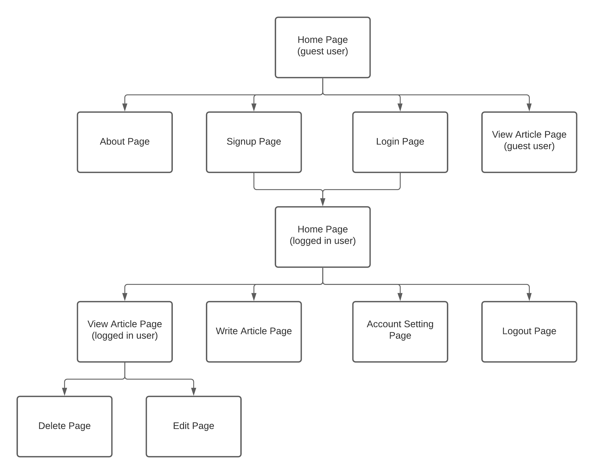

<div align="center">
    
    <h1>Open Blog</h1>
    <strong>Aplikasi blog yang dibuat untuk rumah digunakan penulis.</strong>
</div>
<br>
<div align="center">
    <a href="https://drone-gh.zecrea.my.id/FP-PEMWEB-KEL-7/OpenBlog">
        
    </a>
	<a href="https://github.com/FP-PEMWEB-KEL-7/OpenBlog/blob/master/license.txt">
        
    </a>
</div>
<div align="center">
    <a href="https://pemwebn.zecrea.my.id/"><b>Website</b></a>
	<br><br>
</div>

---

# Daftar Isi
- [Pengantar](#pengantar)
  - [Deskripsi Aplikasi](#deskripsi-aplikasi)
  - [Disusun Oleh](#disusun-oleh-kelompok-7)
- [Screenshot Halaman Utama](#screenshot-halaman-utama)
- [Sitemap](#sitemap)
  - [Penjelasan Sitemap](#penjelasan)
- [Teknologi Yang Digunakan](#teknologi-yang-digunakan)
- [Cara Penggunaan](#cara-penggunaan)
- [Fitur](#fitur)
- [Penjelasan Kode](#penjelasakan-struktur-aplikasi-source-code)

---

# Pengantar

#### **Deskripsi Aplikasi**

Open Blog adalah sebuah website artikel blog yang ramah digunakan untuk semua kalangan usia. Dimana di dalam nya dapat menuangkan kata kata yang berasal dari sebuah ide kreatifitas dengan tampilan web yang user friendly dan juga melihat artikel artikel yang menarik untuk dibaca

#### **Disusun Oleh (Kelompok 7)**

1. Abiyan Naufal Hilmi [19081010135]
2. Dimas Aditya Putra [19081010190]
3. Michael Jeffry Setiawan [19081010007]
4. Muhammad Rakha Firjatullah [19081010050]
5. Nico Natanael [19081010023]

---

# Screenshot Halaman Utama


---

# Sitemap


#### **PENJELASAN**

- Pada Home Page, pengguna bisa mengakses/menuju ke Home Page, Login, dan Sign Up.
  - Selanjutnya, saat berada di home page juga dapat Melihat Semua Artikel, dan Membaca Artikel Pilihan.
- Saat pengguna selesai melakukan Login atau Sign Up, akan menuju ke halaman Home Login.
- Pada Home Login pengguna dapat mengakses Log Out, Membaca Artikel Pilihan, Membaca Artikel, Update Profil, Update Artikel, dan Melihat Artikel yang Telah Ditulis.

---
# Teknologi Yang Digunakan

**CodeIgniter 3**

Salah satu Framework PHP kuat dan tahan lama yang sangat populer dengan menggunakan Konsep MVC dan sering digunakan oleh developer dan komunitas di seluruh penjuru dunia. Dengan menggunakan Framework ini pula kita tidak akan terlalu kesulitan mencari tutorial yang membahas framework ini karena Developer Codeigniter 3 sudah menyediakan dokumentasi secara lengkap atau Table of Content yang bisa kalian lihat di User Guide.

**MySQL**

Sistem manajemen database relasional (RDBMS) berbasis SQL (Structured Query Language) yang bersifat open-source dengan model client-server.

---

# Cara Penggunaan

Sesuai dengan deskripsi aplikasi diawal, website ini berisi artikel artikel dimana user dapat membuat artikel secara pribadi dan dipublikasikan. 

#### **SEBELUM LOGIN**
Pada tahap awal sebelum login, user akan diperlihatkan dengan website yang sederhana, namun memanjakan mata.
Disini user akan diperlihatkan beberapa artikel yang telah tersedia . Namun, pengguna yang belum login tidak dapat membuat artikel, dapat langsung menuju fitur sign up, dan melukan login.
Untuk about, login dan sign up, terletak pada bagian kanan atas website. Jika kita menekan logo OpenBlog maka akan menuju ke tampilan home. User juga dapat melihat perancang website OpenBlog dengan menekan About, yang terletak pada navigation.
#### **SETELAH LOGIN**
Pada tahap selanjutnya, user kita asumsikan telah melakukan tahap login. Disini cara penggunaan aplikasi tidak jauh berbeda saat user belum melakukan login. Yang berbeda hanya user dapat melakukan penulisan artikel dan diposting. User juga dapat melihat halaman profil yang terletak di foto profil bagian atas kanan. Pada foto profil bagian kanan atas juga terdapat fitur sign out. Untuk melakukan penulisan artikel terletak pada logo (+(plus)) yang terletak pada kiri foto profil.

---

# Fitur

Sebelum Login (guest)
- **Navigation**
  <br>Pada Navigation terdapat fitur home, sign in, dan sign up.
  <br><Br>
  Untuk fitur home sendiri terletak pada logo OpenBlog. Jika kita menekan logo OpenBlog maka akan menuju ke halaman home.
  <br><br>
  Untuk fitur sign in terletak pada kanan atas navigation. Dimana jika kita menekan-nya akan menuju ke halaman sign in. User akan mengisi email dan password yang telah dibuat saat sign up.
  <br><br>
  Untuk fitur sign up terletak disamping kanan sign in, dengan nama 'Get Started'. Jika kita menekan-nya makan akan menuju ke halaman sign up, user diharapkan menisi email dan password.

- **Header**
  <br>Pada header website terdapat tampilan sederhana, yang mana didalam nya terdapat kalimat 'Start Writing'. Jika user menekan-nya, user akan langsung menuju halaman login.

- **Body**
  <br>Pada body website terdapat tampilan artikel artikel yang telah dibuat oleh user. Dan terdapat search bar untuk mencari artikel.

- **Halaman Postingan**
  <br>Pada halaman ini user melihat isi artikel yang telah dipilih untuk dibaca. Terdapat penulis, dan juga foto artikel.

Sesudah Login
- **Navigation**
  <br>Berbeda dengan navigation sebelum login. Pada saat user melewati tahapan login. Tampilan navigation akan berubah warna, terdapat foto profil, dan juga logo (+).
  <br><br>Pada foto profil dapat ditekan dan menampilkan markdown yang berisi setting, dan juga sign out.
  <br><br>Jika kita ingin menulis artikel dapat menekan logo (+). Sama halnya dengan navigation pada saat user belum login, logo OpenBlog jika ditekan akan menuju ke halaman home.
- **Setting**
  <br>Pada halaman setting terdapat fitur untuk mengganti foto profil, nama, dan juga password.
- **Body**
  <br>Untuk body website OpenBlog berisi artikel artikel yang user telah buat. Dan dapat dilihat dengan menekan judul artikel.
- **Halaman Postingan**
  <br>Pada halaman ini user melihat isi artikel yang telah dipilih untuk dibaca. Terdapat penulis, dan juga foto artikel.
- **Halaman Write Artikel**
  <br>Pada halaman ini, user akan mengisi foto artikel, judul artikel, dan isi artikel. Jika telah selesai, menekan tombol submit.

---

# Penjelasakan Struktur Aplikasi (source code)
Berikut adalah struktur aplikasi yang terpenting

```bash
├── application/
│   ├── config/
│   │   ├── autoload.php
│   │   ├── config.php
│   │   ├── database.php
│   │   └── routes.php
│   ├── controllers/
│   │   ├── About.php
│   │   ├── Home.php
│   │   ├── Login.php
│   │   ├── Logout.php
│   │   ├── Post.php
│   │   ├── Setting.php
│   │   ├── Signup.php
│   │   └── Write.php
│   ├── models/
│   │   ├── Akun.php
│   │   └── Artikel.php
│   └── views/
│       ├── about.php
│       ├── home_logged_in.php
│       ├── home.php
│       ├── login.php
│       ├── post.php
│       ├── setting.php
│       ├── signup.php
│       └── write.php
└── .htaccess
```
## Folder View
##### home.php
File ini berisi kode-kode untuk tampilan pada beranda/halaman utama website.
##### about.php
File ini berisi kode-kode untuk tampilan detail terkait web ini dan pembuatnya.
##### login.php
File ini berisi kode-kode untuk tampilan login.
##### signup.php
File ini berisi kode-kode untuk tampilan signup.
##### write.php
File ini berisi kode-kode untuk tampilan menulis isi artikel.
##### post.php
File ini berisi kode-kode untuk tampilan isi artikel.
##### settings.php
File ini berisi kode-kode untuk merubah detail informasi pada user.
##### home_logged_in.php
File ini berisi kode-kode untuk tampilan pada beranda/halaman utama website setelah login.

## Folder Config
Kode-kode yang berada pada folder “config” berfungsi untuk konfigurasi pada website. Beberapa kode-kode inti/file penting yang terdapat pada folder tersebut, yaitu :

##### autoload.php
File konfigurasi yang pertama yaitu autoload.php, file ini digunakan untuk mengatur fungsi-fungsi yang akan dimuat otomatis di awal ketika program dijalankan.<br>
##### config.php
Pada file ini terdapat beberapa onfigurasi yang secara standar sudah terkonfigurasi.
##### database.php
Dilihat dari nama filenya maka anda sudah dapat menangkap apa fungsi dari file ini. File database.php digunakan untuk melakukan konfigurasi yang berkaitan dengan konfigurasi database dari website yang akan dibuat.
##### routes.php
Untuk anda yang belum memahami tentang route akan saya gambarkan tentang penggunaan dari route itu sendiri. Route adalah salah satu cara untuk mengatur jalur atau rute yang digunakan untuk mengakses sebuah halaman website. Route ini juga sering digunakan agar tampilan link dari website yang dibuat lebih simpel dan lebih mudah untuk dipahami. Route juga bisa diartikan sebagai versi alias dari jalur utama menuju alamat asli.

## Folder Controllers
##### home.php
File ini berisi kode-kode untuk membuat logic pada beranda/halaman utama website.
##### about.php
File ini berisi kode-kode untuk membuat logic detail terkait web ini dan pembuatnya.
##### login.php
File ini berisi kode-kode untuk membuat logic login.
##### signup.php
File ini berisi kode-kode untuk membuat logic signup.
##### write.php
File ini berisi kode-kode untuk membuat logic menulis isi artikel.
##### post.php
File ini berisi kode-kode untuk membuat logic isi artikel.
##### settings.php
File ini berisi kode-kode untuk merubah detail informasi pada user.
##### home_logged_in.php
File ini berisi kode-kode untuk membuat logic pada beranda/halaman utama website setelah login.
